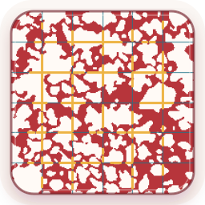

# Lingappan MLI Analyzer

<p align="center">
  
</p>

Lingappan MLI Analyzer measures mean linear intercept (MLI) from pre-cropped lung histology fields.

Use the hosted Gradio app here: [Lingappan MLI Analyzer on Hugging Face Spaces](https://huggingface.co/spaces/LingappanLab/LingappanMLI).

The default workflow follows the chord-measurement approach described by Crowley et al.:

> Crowley G. et al. *Quantitative lung morphology: semi-automated measurement of mean linear intercept.* BMC Pulmonary Medicine 19, 206 (2019). https://doi.org/10.1186/s12890-019-0915-6

## Use case

Use this app with cropped field or ROI images selected before upload. The app does not choose fields from whole-slide images.

For each field, the app identifies airspace, places systematic test lines, measures airspace chords, and summarizes MLI for each field and slide.

## Inputs

Upload cropped 2D field/ROI images. TIFF is the format used in the reference workflow; this app also accepts PNG, JPEG, and BMP. Masks are not required: the app creates an airspace mask from the uploaded image using thresholding. The first frame/page of TIFF images is used for analysis.

Also provide:

- Pixel width and height in µm/px.
- Calibration source.
- The slide/field separator used in filenames.
- Optional notes describing how fields were selected or excluded before upload.

### Filename grouping

The slide/field separator tells the app how to split each filename into a slide ID and a field/ROI ID. The app uses the final occurrence of the separator before the file extension.

| Filename | Separator | Slide used for grouping | Field ID |
| --- | --- | --- | --- |
| `MouseA_0001.tif` | `_` | `MouseA` | `0001` |
| `MouseA_0002.tif` | `_` | `MouseA` | `0002` |
| `MouseA_left_lung_0003.tif` | `_` | `MouseA_left_lung` | `0003` |
| `MouseA-field03.tif` | `-` | `MouseA` | `field03` |

Files with the same slide ID are combined in one slide summary. If the separator is not found, the whole filename stem becomes the slide ID and the field is recorded as `field`.

## How measurement works

The app converts each image into an airspace map using the selected threshold method. Huang thresholding is the default.

It then draws horizontal and/or vertical test lines across the airspace map. Each test line is one pixel wide. A chord is one continuous stretch of airspace along a test line. The app measures each accepted chord in pixels and converts the length to micrometers from the supplied calibration.

Edge-touching chords are excluded by default because the image boundary cuts them off.

## Outputs

Key files in each run:

```text
lingappan_mli_results.xlsx       compact workbook with results
audit/lingappan_mli_audit.xlsx   parameters and other information used on the run
all_chords.csv                   measure and basic data of each measured chord
audit/all_chords_audit.csv       full chord table with coordinates
parameters.json                  run settings and calibration metadata
README_results.md                output notes
<image_name>/qc_panel.png        per-image QC panel
<image_name>/06_qc/              segmentation and rejected-edge-chord overlays
```

Per-image folders also include preprocessing images, contour overlays, MLI overlays, optional non-airspace chord overlays, per-image chord tables, and `summary.json`.

Complete column definitions are in [`docs/methods.md`](docs/methods.md).

## Interpreting results

- The primary MLI result is the mean accepted airspace chord length.
- When both horizontal and vertical lines are used, the app averages the two orientation-specific means for the main field-level MLI value.
- Slide summaries treat fields as the unit. Chord-pooled summaries are secondary because fields with more accepted chords contribute more weight.
- Non-airspace chord output is a line-sampling statistic.
- Connected-component area outputs summarize segmented airspace objects, not individual alveoli.
- Multi-page TIFFs are analyzed from frame/page 0 only; this is recorded in the processing log.
- Batch QC warnings flag mixed analyzed pixel dimensions or substantially different physical field sizes across a run.
- CLI and app preflight checks reject unreadable or oversized images before analysis; CLI limits can be adjusted with `--max-image-pixels`, `--max-image-dimension`, `--max-image-file-bytes`, and `--max-image-total-bytes`.

## CLI example

```bash
lingappan-mli ./input_fields --output ./results \
  --pixel-width-um 0.57 \
  --pixel-height-um 0.57 \
  --calibration-source "stage micrometer calibration, 20x objective" \
  --grid-strategy count \
  --num-lines 15 \
  --orientation both \
  --zip
```

Useful options:

```bash
# Use physical line spacing.
--grid-strategy spacing --line-spacing-um 35.4

# Reproduce systematic-random grid placement.
--grid-random-seed 20260519

# Export non-airspace chord statistics.
--measure-non-airspace
```